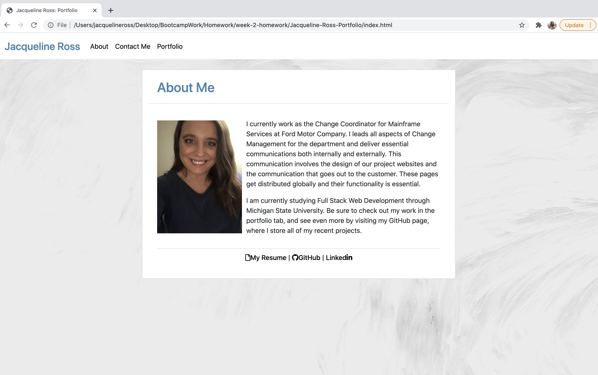
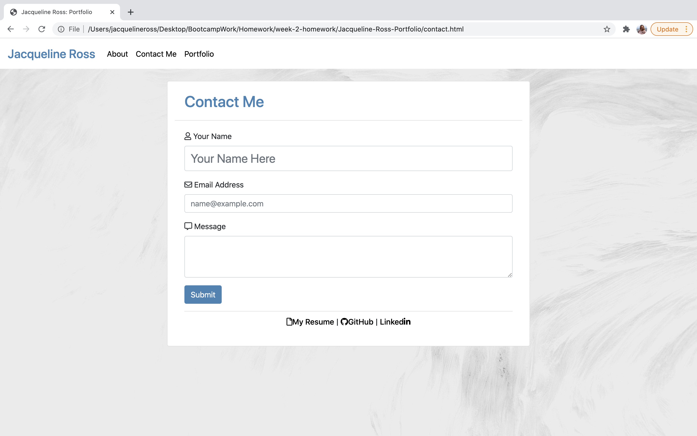
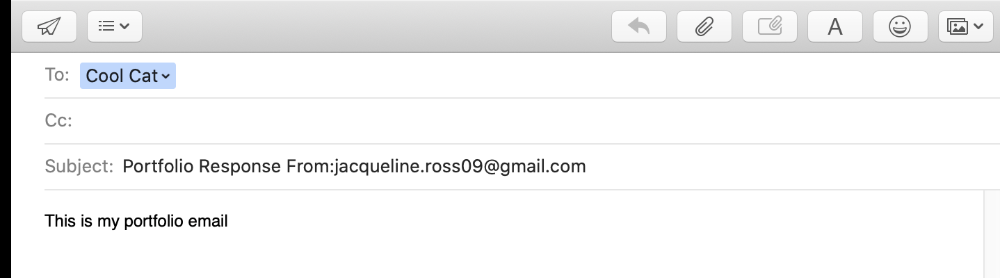
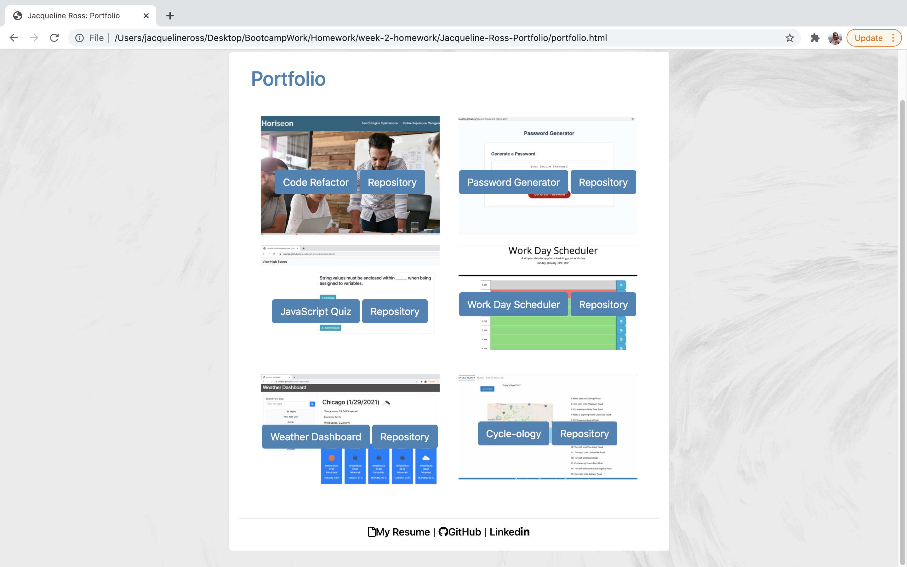

# Jacqueline Ross Portfolio

In this portoflio you will find three html documents, each that were designed for mobile-first to ensure that they render well on a variety of devices and screens. These responsive pages were made using Bootstrap CSS Framework and Javascript. 

# Jacqueline Ross Portfolio - Deployed Applicaiton 
https://ross1jk.github.io/Jacqueline-Ross-Portfolio/

# Mockup 

### About Me

### Contact Me with generated email example

### Portfolio

## Functionality 

contact.html: will generate an email to send based on user input if you select submit 

portfolio.html: has an image for each deployed application and buttons that will lead you either to the deployed application or the repository itself

All html is responsive

All html has links to my resume, github and linked in. My Resume contains my email, and phone number. 